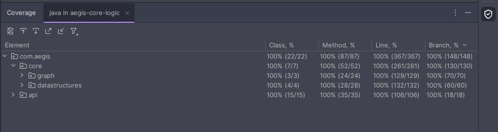

# 🛡️ Aegis Core Logic

> Sistema inteligente de roteamento seguro para transporte de valores

[](https://www.oracle.com/java/)
[](https://spring.io/projects/spring-boot)
[](LICENSE)
[](tests)

---

## 📚 Sobre o Projeto

**Aegis Core Logic** é um trabalho acadêmico desenvolvido para a unidade curricular de **Estrutura de Dados e Análise de
Algoritmos** do curso de Ciência da Computação, ministrada pelo **Prof. Dr. Bruno Mulina** (Doutor em Engenharia
Mecânica).

O projeto implementa um **sistema de roteamento seguro** para empresas de transporte de valores, utilizando conceitos
avançados de estruturas de dados e algoritmos de grafos para calcular as rotas mais seguras entre agências bancárias e
caixas eletrônicos (ATMs).

### 🎯 Objetivo

Criar uma API RESTful que calcule rotas otimizadas considerando **segurança** (índice de risco) e **distância**,
utilizando algoritmos de grafos e estruturas de dados implementadas do zero (sem uso de Collections do Java).

### 💡 Contexto e Motivação

O projeto surgiu da necessidade de resolver um problema real: empresas de transporte de valores precisam planejar rotas
que minimizem riscos de assaltos e otimizem a distância percorrida. O Aegis implementa:

- **Algoritmo de Dijkstra** modificado para encontrar o caminho de menor risco
- **Detecção de Pontos Críticos** (pontos de articulação) no grafo de rotas
- **Cálculo de custo combinado** considerando risco e distância
- **API REST** para integração com outros sistemas

---

## 🚀 Funcionalidades

### 1. 🗺️ Cálculo de Rota Mais Segura

Encontra o caminho entre dois pontos (origem → destino) que minimiza o risco total, considerando:

- Índice de risco de cada trecho
- Distância entre pontos
- Peso configurável entre segurança e distância

### 2. ⚠️ Identificação de Pontos Críticos

Identifica locais estratégicos (pontos de articulação) no grafo que, se bloqueados, podem isolar partes da rede de
rotas.

### 3. 📊 Validação de Tipos de Destino

Garante que rotas só podem ser calculadas para destinos válidos:

- **Agências (AG-)**: Pontos de coleta/entrega
- **Caixas Eletrônicos (ATM-)**: Pontos de abastecimento

### 4. 💾 Cache Inteligente

Sistema de cache para otimizar consultas repetidas:

- Cache de rotas calculadas
- Cache de pontos críticos
- Invalidação automática ao recarregar o grafo

---

## 🏗️ Arquitetura do Sistema

O projeto segue uma arquitetura em camadas bem definida:

```
┌─────────────────────────────────────────────────────────────┐
│                     API REST Layer                           │
│  (Controllers, DTOs, Exception Handlers)                     │
└──────────────────────┬──────────────────────────────────────┘
                       │
┌──────────────────────▼──────────────────────────────────────┐
│                  Service Layer                               │
│  (Business Logic, Cost Calculation, Cache)                   │
└──────────────────────┬──────────────────────────────────────┘
                       │
┌──────────────────────▼──────────────────────────────────────┐
│                  Core Logic Layer                            │
│  (Graph Algorithms, Data Structures)                         │
└──────────────────────┬──────────────────────────────────────┘
                       │
┌──────────────────────▼──────────────────────────────────────┐
│                  Persistence Layer                           │
│  (H2 Database, Repositories, Entities)                       │
└─────────────────────────────────────────────────────────────┘
```

### 📦 Camadas Principais

#### 1. **API REST (`com.aegis.api`)**

- `AegisController`: Expõe endpoints REST
- `DTOs`: Objetos de transferência de dados
- `GlobalExceptionHandler`: Tratamento centralizado de erros

#### 2. **Service Layer (`com.aegis.api`)**

- `GraphService`: Gerencia o grafo e operações de roteamento
- `DefaultCostCalculator`: Calcula custo combinado (risco + distância)
- Cache de rotas e pontos críticos

#### 3. **Core Logic (`com.aegis.core`)**

- `Graph`: Implementação do grafo direcionado
- `Vertex`: Representa locais (agências, ATMs, cruzamentos)
- `Edge`: Representa conexões entre locais
- **Estruturas de Dados Customizadas:**
    - `MyLinkedList`: Lista encadeada
    - `MyMinHeap`: Heap mínimo (para Dijkstra)
    - `MyStack`: Pilha (para detecção de pontos críticos)

#### 4. **Persistence Layer (`com.aegis.api`)**

- `H2VertexRepository`: Gerencia vértices no banco
- `H2EdgeRepository`: Gerencia arestas no banco
- `VertexEntity` / `EdgeEntity`: Entidades JPA

---

## 📂 Estrutura de Pastas

```
aegis-core-logic/
├── src/
│   ├── main/
│   │   ├── java/
│   │   │   └── com/
│   │   │       └── aegis/
│   │   │           ├── api/                    # Camada API REST
│   │   │           │   ├── AegisApiApplication.java
│   │   │           │   ├── AegisController.java
│   │   │           │   ├── GraphService.java
│   │   │           │   ├── IGraphService.java
│   │   │           │   ├── config/             # Configurações (Swagger, Cache)
│   │   │           │   ├── dto/                # Data Transfer Objects
│   │   │           │   ├── entity/             # Entidades JPA
│   │   │           │   ├── exception/          # Handlers de exceção
│   │   │           │   ├── repository/         # Repositórios (H2)
│   │   │           │   └── strategy/           # Estratégias de cálculo
│   │   │           └── core/                   # Camada Core (Algoritmos)
│   │   │               ├── datastructures/     # Estruturas de dados customizadas
│   │   │               │   ├── MyLinkedList.java
│   │   │               │   ├── MyMinHeap.java
│   │   │               │   └── MyStack.java
│   │   │               └── graph/              # Implementação do Grafo
│   │   │                   ├── Graph.java
│   │   │                   ├── Vertex.java
│   │   │                   └── Edge.java
│   │   └── resources/
│   │       ├── application.properties          # Configurações da aplicação
│   │       └── data.sql                        # Dados iniciais (16 vértices)
│   └── test/
│       └── java/                               # 144 testes unitários
├── target/                                     # Build artifacts
├── .github/
│   └── workflows/
│       └── ci.yml                              # GitHub Actions CI/CD
├── docs/
│   └── assets/                                 # Imagens e recursos
├── README.md                                   # Este arquivo
├── pom.xml                                     # Configuração Maven
├── lefthook.yml                                # Git hooks
└── commitlint.config.js                        # Validação de commits
```

---

## 🛠️ Tecnologias Utilizadas

### Backend

- **Java 17**: Linguagem de programação
- **Spring Boot 3.3.6**: Framework web
- **Spring Cache**: Sistema de cache
- **H2 Database**: Banco de dados em memória
- **Spring JDBC**: Acesso ao banco de dados

### Documentação e Testes

- **SpringDoc OpenAPI 3**: Documentação automática (Swagger)
- **JUnit 5**: Framework de testes
- **Mockito**: Mock objects para testes
- **JaCoCo**: Cobertura de código

### Build e CI/CD

- **Maven**: Gerenciamento de dependências
- **GitHub Actions**: Integração contínua
- **Lefthook**: Git hooks para validação

---

## 📋 Pré-requisitos

Antes de começar, você precisa ter instalado:

- ✅ **Java JDK 17** ou superior ([Download aqui](https://www.oracle.com/java/technologies/downloads/#java17))
- ✅ **Maven 3.6+** ([Download aqui](https://maven.apache.org/download.cgi))
- ✅ **Git** ([Download aqui](https://git-scm.com/downloads))
- ✅ (Opcional) **Postman** ou **Insomnia** para testar a API

### ✅ Verificando as instalações

Abra o terminal e execute:

```bash
# Verificar Java
java -version
# Saída esperada: java version "17.x.x"

# Verificar Maven
mvn -version
# Saída esperada: Apache Maven 3.x.x

# Verificar Git
git --version
# Saída esperada: git version 2.x.x
```

---

## 🚀 Guia de Instalação e Execução (Passo a Passo)

### 1️⃣ Clonar o Repositório

```bash
# Clone o projeto
git clone https://github.com/seu-usuario/aegis-core-logic.git

# Entre na pasta do projeto
cd aegis-core-logic
```

### 2️⃣ Abrir o Projeto na IDE

#### Opção 1: IntelliJ IDEA (Recomendado)

1. Abra o IntelliJ IDEA
2. Clique em **File → Open**
3. Navegue até a pasta `aegis-core-logic` e selecione
4. Aguarde o IntelliJ importar as dependências do Maven automaticamente
5. Localize o arquivo `src/main/java/com/aegis/api/AegisApiApplication.java`
6. Clique com o **botão direito** no arquivo
7. Selecione **Run 'AegisApiApplication'**

#### Opção 2: Visual Studio Code

1. Abra o VS Code
2. Instale as extensões necessárias:
    - **Extension Pack for Java** (da Microsoft)
    - **Spring Boot Extension Pack** (da VMware)
3. Abra a pasta do projeto: **File → Open Folder → aegis-core-logic**
4. Aguarde o VS Code carregar as dependências
5. Localize o arquivo `src/main/java/com/aegis/api/AegisApiApplication.java`
6. Clique com o **botão direito** no arquivo
7. Selecione **Run Java**

### 3️⃣ Verificar se a Aplicação Iniciou

**Aguarde a mensagem no console:**

```
Started AegisApiApplication in X.XXX seconds
```

✅ A aplicação estará rodando em: **http://localhost:8080**

---

## 🧪 Testando a Aplicação

### Opção 1: Usando o Swagger UI (Recomendado para Iniciantes)

1. **Certifique-se de que a aplicação está rodando**
2. Abra o navegador e acesse: **http://localhost:8080/swagger-ui.html**
3. Você verá a interface interativa da API com todos os endpoints disponíveis
4. Clique em qualquer endpoint para expandir (exemplo: **GET /api/aegis/route**)
5. Clique em **"Try it out"**
6. Preencha os parâmetros:
    - `origin`: `AG-01`
    - `destination`: `ATM-05`
7. Clique em **"Execute"**
8. Veja a resposta JSON com a rota calculada!

**Exemplo de resposta:**

```json
{
  "totalCalculatedCost": 465,
  "route": [
    {
      "name": "Agencia Central",
      "id": "AG-01"
    },
    {
      "name": "Cruzamento A - Centro",
      "id": "CRZ-01"
    },
    {
      "name": "Cruzamento D - Bairro Residencial",
      "id": "CRZ-04"
    },
    {
      "name": "Universidade Federal ATM",
      "id": "ATM-05"
    }
  ]
}
```

### Opção 2: Usando Postman

1. Abra o Postman
2. Crie uma nova requisição **GET**
3. Cole a URL: `http://localhost:8080/api/aegis/route?origin=AG-01&destination=ATM-05`
4. Clique em **Send**
5. Veja a resposta JSON no painel inferior

### Opção 3: Acessando o Console do Banco de Dados H2

Você pode visualizar os dados diretamente no banco H2:

1. **Certifique-se de que a aplicação está rodando**
2. Abra o navegador e acesse: **http://localhost:8080/h2-consola**
3. Preencha os campos de conexão:
    - **JDBC URL**: `jdbc:h2:mem:aegisdb`
    - **User Name**: `sa`
    - **Password**: `password`
4. Clique em **Connect**
5. Você poderá visualizar as tabelas `VERTICES` e `EDGES` e executar queries SQL

**Exemplos de queries úteis:**

```sql
-- Ver todos os vértices
SELECT * FROM VERTICES;

-- Ver todas as conexões (arestas)
SELECT * FROM EDGES;

-- Ver rotas partindo de uma agência específica
SELECT * FROM EDGES WHERE origin_id = 'AG-01';
```

---

## 📊 Endpoints da API

### 1. **Calcular Rota Mais Segura**

```http
GET /api/aegis/route
```

**Parâmetros:**

- `origin` (string, obrigatório): ID do local de origem
- `destination` (string, obrigatório): ID do destino (deve começar com `AG-` ou `ATM-`)

**Exemplo:**

```bash
GET http://localhost:8080/api/aegis/route?origin=AG-01&destination=ATM-05
```

### 2. **Listar Pontos Críticos**

```http
GET /api/aegis/critical-points
```

**Exemplo:**

```bash
GET http://localhost:8080/api/aegis/critical-points
```

---

## 🧪 Cobertura de Testes

### Estatísticas de Testes

- **Total de testes:** 144 ✅
- **Cobertura de classes, métodos, linhas e Branch:** 100% ✅
- **Tempo de execução:** ~10 segundos



---

## 🔧 Configurações

### Alterar a Porta da Aplicação (Opcional)

Edite o arquivo `src/main/resources/application.properties`, adicionando:

```properties
server.port=8080  # Altere para a porta desejada
```

### Acesso ao Console H2

O banco de dados H2 possui um console web para visualização e manipulação dos dados:

- **URL**: http://localhost:8080/h2-consola
- **JDBC URL**: `jdbc:h2:mem:aegisdb`
- **User Name**: `sa`
- **Password**: `password`

### Configurar Peso do Cálculo de Custo

Por padrão, o sistema usa:

- **70% peso para risco**
- **30% peso para distância**

Para alterar, modifique a classe `DefaultCostCalculator`.

---

## 📚 Documentação Adicional

- **Swagger UI**: http://localhost:8080/swagger-ui.html (quando a aplicação estiver rodando)
- **H2 Console**: http://localhost:8080/h2-consola (para visualizar o banco de dados)

---

## 🎓 Estruturas de Dados Implementadas

Este projeto **NÃO utiliza Collections do Java**, todas as estruturas foram implementadas do zero:

### 1. **MyLinkedList**

- Lista duplamente encadeada
- Operações: add, remove, get, contains, indexOf
- Complexidade: O(n) para busca, O(1) para inserção/remoção nas extremidades

### 2. **MyMinHeap**

- Heap mínimo baseado em array
- Usado no algoritmo de Dijkstra
- Operações: insert, extractMin, decreaseKey
- Complexidade: O(log n) para operações principais

### 3. **MyStack**

- Pilha baseada em array dinâmico
- Usado na detecção de pontos críticos (DFS)
- Operações: push, pop, peek, isEmpty
- Complexidade: O(1) para todas as operações

---

## 🧮 Algoritmos Implementados

### 1. **Dijkstra Modificado**

Encontra o caminho de menor custo (risco + distância) entre dois vértices.

**Complexidade:** O((V + E) log V)

- V = número de vértices
- E = número de arestas

### 2. **Tarjan (Pontos de Articulação)**

Identifica pontos críticos no grafo usando DFS.

**Complexidade:** O(V + E)

---

## 🤝 Sobre o Fluxo de Trabalho usado (Git Flow e Padrão de Commits)

Este é um projeto acadêmico, mas utilizamos as melhores práticas!

### Workflow Git Flow

```bash
# Criar nova branch para feature
git checkout -b feature/nome-da-feature

# Criar nova branch para correção
git checkout -b fix/nome-do-fix

# Criar nova branch para documentação
git checkout -b docs/nome-da-doc

# Criar nova branch para testes
git checkout -b test/nome-do-teste
```

### Padrão de Commits

Seguimos o **Conventional Commits**:

```
feat: adiciona nova funcionalidade
fix: corrige um bug
docs: atualiza documentação
test: adiciona ou corrige testes
refactor: refatora código sem alterar funcionalidade
chore: tarefas de manutenção
```

Além de validação pre-commit com **Lefthook** 👊 e **Commitlint** ✍️.

---

## 👨‍🏫 Informações Acadêmicas

- **Disciplina:** Estrutura de Dados e Análise de Algoritmos
- **Professor:** Dr. Bruno Mulina (Doutor em Engenharia Mecânica)
- **Instituição:** Universidade Anhembi Morumbi (UAM)
- **Período:** 2025/2

### 👨‍🎓 Alunos

| Nome                                 | RA          |
|--------------------------------------|-------------|
| **Amanda Duarte Meneghini do Carmo** | 12522192773 |
| **Renato Gonçalves Machado**         | 12524137779 |
| **Andy Hyong Tae Choi Youn**         | 12522142446 |
| **Sedra Alhendi**                    | 12525220383 |

---

## 🩼 Suporte

Se você encontrar problemas ao executar o projeto:

1. ✅ Verifique se o Java 17 está instalado corretamente
2. ✅ Certifique-se de que a porta 8080 está livre
3. ✅ Execute o projeto através da IDE (IntelliJ ou VS Code)
4. ✅ Verifique se as extensões do Java estão instaladas (se estiver usando VS Code)

---

## Agradecimentos

- **Prof. Dr. Bruno Mulina** pela orientação e conhecimento compartilhado
- Ao querido antigo amigo de classe [Kauã dos Santos](https://github.com/kauassilva) pela orientação inicial
- Todos que contribuíram com feedback e sugestões


